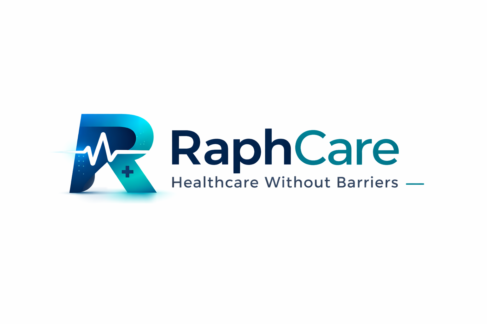

<h1>RaphCare incubator plan</h1>

Priority list for founders · September 2026

This is the shared plan for which accelerators and incubators we apply to, in what order, and why each one is on the list. It is for the founding team. Deadlines move every cohort, so confirm the apply link before you submit.

**Last reviewed:** 5 September 2026

## How to read this

- **Priority** is fit for RaphCare today: Johannesburg base, healthtech, working product on staging, not paying clinics yet.
- **Why selected** is why that program is on our list at all.
- **Why this rank** is why it sits above or below the others.
- We keep detailed YC answers in the repo under `docs/incubator/yc/`. Other programs get their own folder when we start that form.

## Priority at a glance

| Priority | Program | Apply when |
|---------:|---------|------------|
| 1 | Y Combinator | Now (current open batch) |
| 2 | Founders Factory Africa (Scale) | Now (rolling) |
| 3 | Techstars (healthcare cohorts) | When a healthcare cohort is open |
| 4 | Africa Health-Tech Accelerator | Next open call (2026 closed) |
| 5 | 500 Global Flagship | Next Flagship batch deadline |
| 6 | Google for Startups Accelerator: South Africa | Register interest; apply next cohort |
| 7 | AUDA-NEPAD Home Grown Solutions (HGS) | Next annual call |
| 8 | Antler East Africa (Nairobi) | Only if we can relocate |
| 9 | a16z Speedrun | Next open batch, after more traction |

---

## 1. Y Combinator

**Why selected:** Best-known early-stage program. Strongest investor signal if we get in. We already applied once with more idea than product; reapplying with a real Portal, Ops site, and patient Android app is the point.

**Why this rank:** Highest upside brand and network. Draft answers are ready. Do this first.

**How to apply:** https://www.ycombinator.com/apply

**Window:** Use the current open batch in the form.

---

## 2. Founders Factory Africa (Scale)

**Why selected:** Based in Johannesburg. Built for African startups. Scale track is for companies that already have a product, not a blank idea. Hands-on support on product, growth, and corporate partnerships matches how we sell hospital software.

**Why this rank:** Best local next step after YC. Rolling applications. Low travel friction.

**How to apply:** https://www.foundersfactory.africa/apply

**Also see:** Scale overview https://www.foundersfactory.africa/scale · Build (idea stage only) https://www.foundersfactory.africa/build

**Window:** Rolling. Apply to **Scale**, not Build.

---

## 3. Techstars (healthcare cohorts first)

**Why selected:** Serious mentorship and capital. Healthcare-specific cohorts (hospital partners, AI health) match a clinic operating system better than a generic city batch.

**Why this rank:** Global brand with a path that can fit healthtech. We only apply when a relevant cohort is open so we do not waste a cycle on the wrong vertical.

**How to apply:** Browse open programs at https://www.techstars.com/accelerators and open the apply flow on the cohort page. Prefer healthcare listings when available (for example Northwestern Medicine, Permanente Medicine Mid-Atlantic, Techstars AI Health Baltimore).

**Window:** Cohort-specific. Spring 2027 windows were opening on Techstars channels; pick a live healthcare cohort, do not apply blind to a closed city.

---

## 4. Africa Health-Tech Accelerator

**Why selected:** Explicitly for African digital health: hospital systems, telemedicine, remote monitoring, health data. Co-hosted with continental health platforms. Closest sector match outside YC.

**Why this rank:** Perfect theme fit, but the 2026 deadline has passed. We keep it high so we catch the next call early.

**How to apply:** Re-check https://menterprise.africa/opportunities/africa-health-tech-accelerator-2026/ or search “Africa Health Tech Accelerator” and the next year when that page shows expired.

**Window:** 2026 deadline passed (30 June 2026). Watch for 2027.

---

## 5. 500 Global Flagship

**Why selected:** Global accelerator with a long history in emerging markets. Useful if we want a non-YC international network and a structured batch in the US flagship track.

**Why this rank:** Strong brand, but less Africa-clinic-specific than Founders Factory or Africa Health-Tech. Worth one solid Flagship application, not every regional side track.

**How to apply:** https://500.co/apply-for-an-accelerator · Flagship: https://500.co/founders/flagship (confirm on 500.co if the path moves)

**Window:** Per-batch deadlines. Skip Eurasia or MENA tracks unless we have real ops there.

---

## 6. Google for Startups Accelerator: South Africa

**Why selected:** Equity-free. South African-led. Strong Google brand, cloud credits, and mentorship. Good once we look more growth-stage and can show AI use in the product (chat assistant, draft summaries).

**Why this rank:** Excellent terms when open, but the 2026 SA window closed and they prefer clearer traction. Register interest now; apply next round after a live pilot if possible.

**How to apply:** https://startup.google.com/programs/accelerator/south-africa/ · Continent shortcut used in past cycles: https://g.co/acceleratorafrica

**Window:** SA 2026 closed (28 August 2026). Register interest for the next cohort.

---

## 7. AUDA-NEPAD Home Grown Solutions (HGS)

**Why selected:** Pan-African health-systems program under AUDA-NEPAD. Digital health and health technology are in scope. Good political and partnership signal across the continent once we look like a growth venture, not only a staging demo.

**Why this rank:** Strong mission fit, but 2026 cohort is already selected and they lean growth or mature. Watch the next annual call.

**How to apply:** Program info https://vc4a.com/auda-nepad/hgs-2026/ · Villgro Africa https://villgroafrica.org/funding_calls/home-grown-solutions-hgs-accelerator-africa/ · Questions: HGSAHealthSol@auda-nepad.org

**Window:** 2026 cohort selected. Wait for the next call.

---

## 8. Antler (East Africa / Nairobi)

**Why selected:** Active Africa investor with a Nairobi residency and pre-seed cheques. Useful network if we were willing to build from East Africa for a stretch.

**Why this rank:** Lower fit today. The residency expects relocation to Nairobi, and Antler’s model is often earlier (idea or co-founder matching). Only pursue if we accept that move.

**How to apply:** https://www.antler.co/apply · Kenya: https://www.antler.co/location/kenya

**Window:** Rolling residencies. Lead with the shipped product if applying as a team.

---

## 9. a16z Speedrun

**Why selected:** Large possible cheque and Andreessen Horowitz brand. Open to founders worldwide with SF in-person program and visa support in past cycles.

**Why this rank:** Highest bar and heaviest relocation. Better after pilots or clear letters of intent, not as our second application this month.

**How to apply:** https://speedrun.a16z.com/ (confirm if the site redirects)

**Window:** 2026-style window closed around May 2026. Revisit the next open batch.

---

## Also watch (not ranked)

| Program | Why on the watch list | How to find |
|---------|------------------------|-------------|
| Stellenbosch LaunchLab / university healthtech | Short local incubation; possible intros | https://www.launchlab.co.za/ |
| Villgro Africa health calls | Often tied to HGS-style health support | https://villgroafrica.org/ |
| Corporate or hospital-group innovation in SA | Pilot path without a public “apply” form | Warm intro after a live Portal demo |

---

## What we do this month

1. Submit **Y Combinator**.
2. Start **Founders Factory Africa Scale**.
3. Check **Techstars** for one open healthcare cohort and apply if dates work.
4. Bookmark Africa Health-Tech, HGS, and Google SA for the **next** open call. Do not fill expired 2026 forms.
5. Before each submit, refresh answers against the live product so claims stay honest.

## What we skip for now

- Idea-stage “find a cofounder” programs (we already have founders and a product).
- FDA device accelerators (RaphCare is healthcare software first, not a diagnostic device pitch).
- Programs that demand relocation we cannot do unless the deal clearly funds that move.
